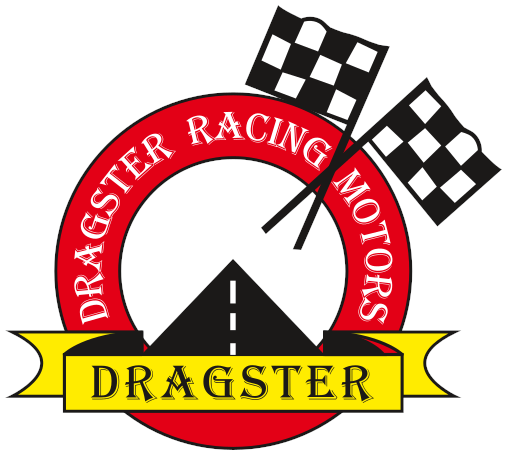
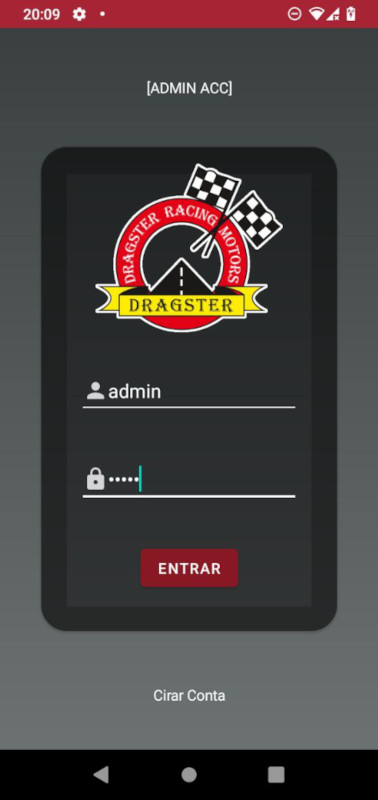

# Dragster

  

 
<h3>Descrição</h3>

Protótipo de aplicativo desenvolvido como requisito do Projeto Integrador 5 do curso de Análise e Desenvolvimento de Sistemas da Faculdade Visconde de Cairu em parceria com a empresa Dragster. O objetivo do aplicativo é criar um canal de interação e fidelização dos clientes da oficina Dragster que é referência em Salvador nos quesitos de manutenação preventiva e corretiva.

 
<h3>Como funciona:</h3>
O cliente da oficina Dragster pode criar a própria conta direto no app ou requisitar que a própria Dragster crie a sua conta. Após isso, ele precisará entrar em contato com a administração da empresa (no menu "Contato") e solicitar que esta cadastre seus veículos e, caso necessário, atualizar suas credenciais. Após ter o veículo cadastrado, o usuário poderá marcar visitas na oficina. 

  

 
